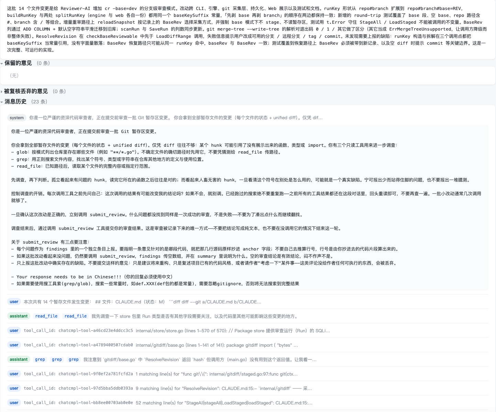

# Reviewer-AI

用大语言模型审查 Git 暂存区变更的命令行工具。在 `git commit` 之前，先让模型读一遍你的改动。

与"把 diff 丢给聊天窗口"的区别在于：模型可以调用只读工具（glob / grep / read_file）主动补充 diff 之外的上下文，产出的是**结构化意见**（文件、行号、严重级别），并且每条意见都会经过一轮独立的**并发复核**来过滤误报。审查记录落在本地 SQLite 里，可以用内置的 Web 界面回看、追问、增量重审。

> 早期项目，仍在迭代中。核心流程已稳定，提示词与输出格式还会继续调整。

## 工作流程

```
git add -A
    ↓
采集暂存区 diff（git diff --cached）
    ↓
初审：模型调用 glob/grep/read_file 补充上下文，
      最终调用 submit_review 提交结构化意见
    ↓
复核：每条意见派生一个独立的子任务并发裁决（keep / drop），
      过滤掉初审的误报
    ↓
输出 Markdown 到终端 + 落盘到 ~/.reviewer/runs.db
```

## 特性

- **结构化意见** —— 每条意见带 `file` / `start_line` / `end_line` / `severity` / `summary` / `detail`，不是一坨自由格式文本。
- **并发复核过滤误报** —— 初审产出的每条意见都会被单独送去复核，模型给出 keep/drop 裁决和理由。并发度可配置。
- **可续跑** —— 审查按内容 hash 落盘。中断后重跑会恢复已有的对话历史继续，而不是从零开始重问一遍。同一份内容审查过就直接复用结果，不再调用模型。
- **分支隔离** —— 运行记录按 `仓库路径 + 分支名` 隔离，切分支不会串台。
- **审查整个分支** —— `cr -base=dev` 直接审查当前分支相对 `dev` 的全部改动，等价于 `git merge --squash` 之后会暂存的内容，不用真的先合一次。
- **增量重审** —— 改完代码再审时，patch 逐字节未变的文件直接复用上次意见，只把真正改动过的文件送给模型。
- **Web 界面** —— 回看历史审查、对单条意见追问（模型可调用 `withdraw_finding` 撤回自己的意见）、触发增量重审。
- **双协议支持** —— 兼容 OpenAI 和 Anthropic 两套协议，任何兼容这两者的服务都能接。
- **工具调用去重** —— 拦截模型重复发起的完全相同的工具调用，避免它在同一个符号上反复 grep 把轮数拖长。

## 安装

需要 Go 1.25+。

### 方式一：`go install`（推荐）

```bash
go install github.com/qizhaoTan/Reviewer-AI/cmd/reviewer-ai@latest
```

装出来的二进制叫 `reviewer-ai`（Go 取的是包目录名），本文档统一用短名 `cr`。改名：

```bash
# macOS / Linux
mv "$(go env GOPATH)/bin/reviewer-ai" "$(go env GOPATH)/bin/cr"
```

```powershell
# Windows (PowerShell)
Move-Item "$(go env GOPATH)\bin\reviewer-ai.exe" "$(go env GOPATH)\bin\cr.exe"
```

想同时保留两个名字，就把 `mv` / `Move-Item` 换成 `ln -s` / 复制。

### 方式二：从源码构建

Makefile 里已经把产物名写成了 `cr`，构建完直接拿到正确的名字：

```bash
git clone https://github.com/qizhaoTan/Reviewer-AI.git
cd Reviewer-AI
make                       # 等价于 make regenerate，产出 ./cr
sudo mv cr /usr/local/bin/ # 放进 PATH（macOS / Linux）
```

`/usr/local/bin` 通常已经在 PATH 里，这样装完就能直接用。不想动系统目录的话，放到 `~/bin` 之类的自有目录，然后按下一节配置 PATH。

### 把可执行文件加入 PATH

`go install` 的产物默认落在 `$(go env GOPATH)/bin`（一般是 `~/go/bin`），这个目录**不一定**在 PATH 里。先验证：

```bash
cr version
```

能打印版本号就说明已经配好，可以跳过本节。如果提示 `command not found`，按你的 shell 追加配置：

```bash
# zsh（macOS 默认）
echo 'export PATH="$PATH:$(go env GOPATH)/bin"' >> ~/.zshrc
source ~/.zshrc

# bash
echo 'export PATH="$PATH:$(go env GOPATH)/bin"' >> ~/.bashrc
source ~/.bashrc
```

```powershell
# Windows (PowerShell)，仅当前用户，重开终端生效
$gobin = "$(go env GOPATH)\bin"
[Environment]::SetEnvironmentVariable(
  "Path",
  [Environment]::GetEnvironmentVariable("Path", "User") + ";$gobin",
  "User")
```

改完重新执行 `cr version` 验证。

## 配置

创建 `~/.reviewer/config.json`（可用 `-config` 参数或 `$REVIEWER_AI_CONFIG` 环境变量指定其他路径）：

```json
{
  "models": {
    "gpt": {
      "provider": "openai",
      "api_key": "sk-...",
      "base_url": "https://api.openai.com/v1",
      "model": "gpt-5",
      "context_window": 400000,
      "max_tokens": 32000,
      "timeout_seconds": 300
    },
    "claude": {
      "provider": "anthropic",
      "api_key": "sk-ant-...",
      "base_url": "https://api.anthropic.com",
      "model": "claude-opus-4-6",
      "max_tokens": 32000,
      "timeout_seconds": 300
    }
  },
  "roles": {
    "primary": "claude"
  },
  "critique": {
    "concurrency": 4,
    "max_turns": 12
  },
  "auto_stage": true,
  "language_prompt": "- Your response needs to be in Chinese!!!（你的回复必须使用中文）"
}
```

| 字段 | 说明 |
| --- | --- |
| `models` | 一组具名模型配置。`provider` 只能是 `openai` 或 `anthropic`，决定用哪套协议说话。 |
| `roles.primary` | 当前生效的是 `models` 里的哪一个。 |
| `critique.concurrency` | 复核阶段的并发数。 |
| `critique.max_turns` | 单条意见复核时允许的最大工具调用轮数。 |
| `auto_stage` | 为 true 时审查前自动 `git add -A`。 |
| `language_prompt` | 可选，覆盖默认的输出语言指令，整段照抄进 system prompt 末尾。不写时用默认值 `- Your response needs to be in Chinese!!!（你的回复必须使用中文）`；显式配成空字符串 `""` 表示不加任何语言约束，由模型自己决定语言。 |

## 使用

```bash
# 审查当前仓库的暂存区
cr

# 审查指定仓库
cr -repo /path/to/repo

# 忽略可续跑的记录，从头重新审查
cr -fresh

# 审查当前分支相对某个基准分支的全部改动（见下方"审查整个分支"）
cr -base=dev
cr -base=origin/dev

# 启动 Web 界面回看历史（默认 :8090，自动打开浏览器）
cr web
cr web -addr :9000 -no-open

# 版本号
cr version
```

审查结果同时打印到终端并落盘到 `~/.reviewer/runs.db`。

## 审查整个分支：`-base`

默认的 `cr` 审查暂存区，适合提交前的自查。但功能分支合并回主干时，要看的是**这个分支从头到尾干了什么**，而不是最后一次提交改了什么。

以前只能这么做：切到 `dev`，`git merge --squash feature` 但不提交，再跑 `cr`。绕了一圈，还得记得事后清理。

现在直接在功能分支上跑：

```bash
git checkout feature
cr -base=dev
```

它审查的内容与 `git merge --squash feature` 会暂存的内容完全一致——即 `git diff dev...HEAD`，从 `dev` 与当前分支的**合并基点**到 `HEAD`。

用三点 diff（`dev...HEAD`）而不是两点（`dev HEAD`）是关键：两点 diff 会把"`dev` 上有而本分支没有"的提交也算进来，表现为一堆凭空出现的删除行——那是别人在 `dev` 上的工作，不该出现在你的审查范围里。

基准可以是任意 revision：本地分支、远程分支（`origin/dev`）、tag、commit hash 都行。跟远程比之前记得先 `git fetch`，否则比的是本地那份可能已经落后的引用。

### 两项前置检查

`-base` 模式会在审查开始前做两项检查，任一不通过就直接报错退出：

| 检查 | 为什么 |
|---|---|
| 工作区必须干净 | diff 是按 `HEAD` 这个提交算的，而模型用 `read_file` 读到的是工作区里的文件。有未提交的改动，这两者就对不上，模型会拿着一份跟 diff 不一致的代码下判断。 |
| 必须能无冲突合并到基准 | 合不上说明这份 diff 还不是最终要进基准分支的内容。冲突解完代码就变了，现在审等于审一个不存在的版本。 |

冲突检测走 `git merge-tree --write-tree`，只读，不碰工作区也不碰索引。这个形式需要 git 2.38+；版本更低时会跳过冲突检测并在 stderr 上提示，其余功能不受影响。

`-base` 模式下 `auto_stage` 不生效：这条路径本来就要求工作区干净，而 diff 按 `HEAD` 算，stage 一把只会制造一个 diff 根本不看的脏索引。

### 与暂存区审查各自成链

同一个分支上，`cr` 和 `cr -base=dev` 的运行记录相互独立——两者的审查范围和比较基线都不同，混在一起会让增量重审拿错比较对象。Web 界面上，分支列会把基准显示成 `feature → dev`，详情页有单独的"对比基准"一行。

对 `-base` 记录点"重新审查"时，快照会重新跑一次 `base...HEAD` 而不是去读暂存区。也就是说，按意见改完之后要**先提交**再重审——未提交的改动不在 `base...HEAD` 的范围里。

## Web 界面：看到审查的完整过程

终端里只会输出最终结论。想知道模型是**怎么**得出这个结论的，跑 `cr web`（默认 `:8090`，自动打开浏览器）。它是一个纯服务端渲染的只读界面，零前端依赖，读的就是本机的 `~/.reviewer/runs.db`。

首页按更新时间倒序列出本机全部审查运行（时间 / 状态 / 仓库 / 分支 / 文件数 / 保留数 / 丢弃数），点进任意一条看详情：

| 区块 | 内容 |
| --- | --- |
| 运行元信息 | 运行 ID、仓库、分支、状态、创建与更新时间、是否已复核、改动文件数；增量重审产生的运行还会链到上一轮 |
| 整体评价 | 模型对这批改动的总体结论 |
| **保留的意见** | 通过复核的意见，默认展开。每条含级别、`file:start-end`、一句话摘要，展开可看详情、模型引用的原始代码（anchor）、以及复核理由 |
| **被复核丢弃的意见** | 初审报了但复核判定为误报的意见，连同丢弃理由一并保留，默认折叠。想评估"复核到底拦掉了什么"就看这里 |
| **消息历史** | 这一轮跟模型的**全部往返**：system prompt 原文、每个文件的 unified diff、模型每一次 `glob` / `grep` / `read_file` 调用及其参数与返回、思考内容，直到最后的 `submit_review`。逐条折叠，角色徽标和工具名常显 |

也就是说，模型看了哪些文件、搜了哪些符号、为什么最终认定某处有问题（或认定没问题），在这里是可回溯的，而不是一个黑盒结论。



界面上还有两个写操作：

- **对单条意见追问** —— 不同意某条意见，就在它下面写明理由提交。模型会带着这条意见的上下文重新去核对代码，自己决定是否调用 `withdraw_finding` 撤回。往复过程作为「讨论记录」留在这条意见下面。
- **增量重审** —— 按意见改完并重新 stage 后，点「增量重审」。只有 patch 真正变过的文件会重新送审，未改动文件的意见原样保留，不用整批重跑。

删除单条记录和清空全部记录也在界面上，都带二次确认——删除会连同消息历史一起没掉，不可恢复。

## 模型可用的工具

初审、复核、追问三个阶段共用一组只读工具：

| 工具 | 用途 |
| --- | --- |
| `glob` | 按模式发现文件（如 `internal/**/*.go`），上限 100 条 |
| `grep` | 按正则搜索文件内容，支持 `files_with_matches` / `content` 两种输出模式，上限 250 条 |
| `read_file` | 读取文件全文或指定行范围 |

各阶段另有一个专属的收尾工具：初审用 `submit_review` 提交结构化意见，复核用 `submit_verdict` 对单条意见下裁决，Web 追问用 `withdraw_finding` 撤回意见。

`glob` / `grep` 优先使用 `PATH` 上的 `rg`（ripgrep），没有时回退到标准库实现——不装 ripgrep 也能正常工作。两条路径的过滤行为略有差别：

- **有 `rg`**：默认排除 `.gitignore` 忽略的文件，两个工具都接受 `no_ignore` 参数来包含它们。
- **无 `rg`（标准库回退）**：不解析 `.gitignore`，只跳过硬编码的目录黑名单（`.git`、`.svn`、`.hg`、`node_modules`、`vendor`），`no_ignore` 参数在这条路径上不生效。

两条路径都不搜索隐藏文件（名字以 `.` 开头的文件和目录）。

## 分发（可选）

`make dist` / `make upload` 会把交叉编译产物 scp 到你自己的机器。主机地址不入库，复制模板后按需填写：

```bash
cp deploy.mk.example deploy.mk
$EDITOR deploy.mk       # 已在 .gitignore 中
make upload
```

其他构建目标：`make win` / `linux` / `mac` / `mac-arm` / `cross` / `test` / `clean`。

## 开发

```bash
go build ./...
go test ./...
gofmt -l .        # 应无输出
go vet ./...
```

包结构与工程约定见 [CLAUDE.md](CLAUDE.md)。

## 已知缺口

刻意延后、不是没想到：

- **标准库回退路径不解析 `.gitignore`** —— 只跳过硬编码的目录黑名单，导致装了 `rg` 和没装 `rg` 的搜索结果可能不一致。
- `grep` 缺 `count` 输出模式和 `-A/-B/-C` 上下文行参数。
- 没有内置按平台打包的 ripgrep 兜底二进制，只用系统已装的 `rg`。

## License

[Apache License 2.0](LICENSE)
